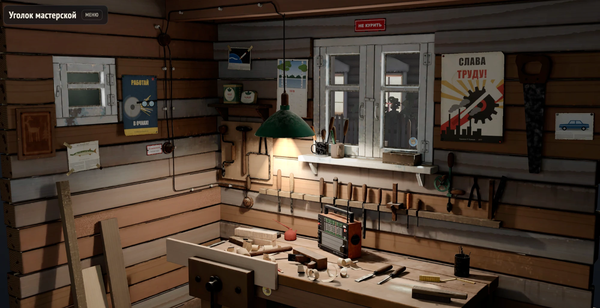
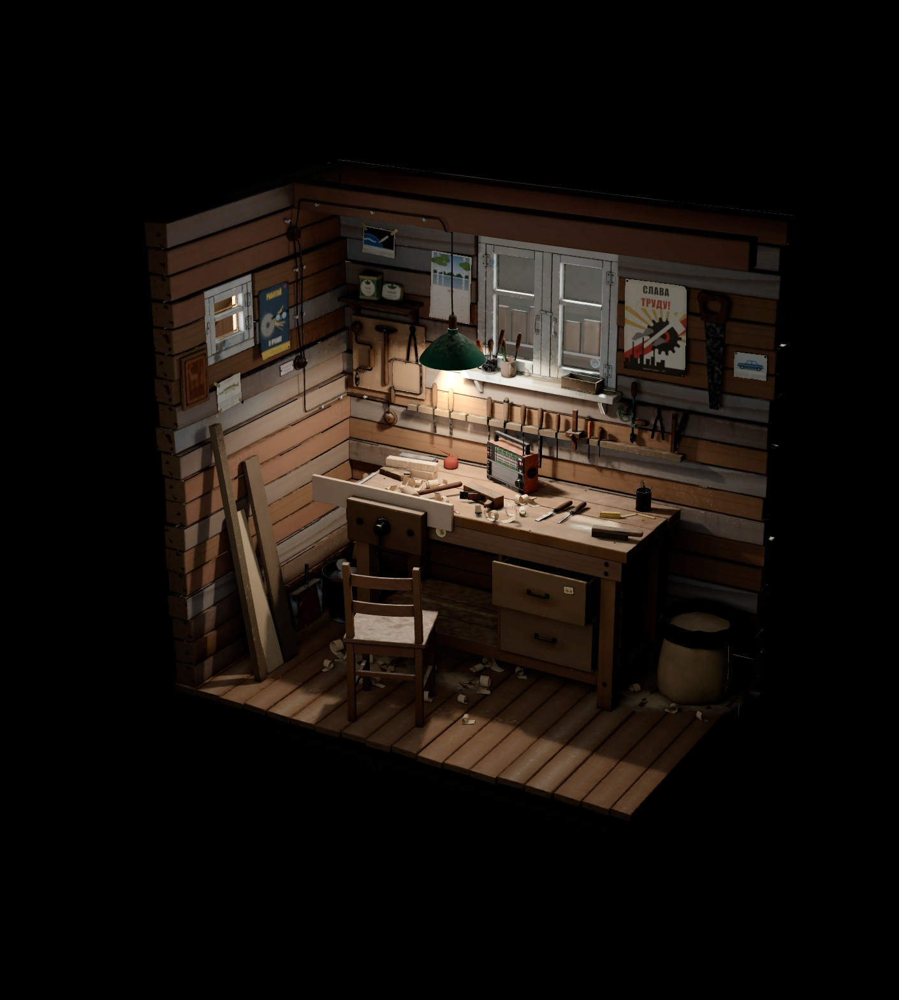
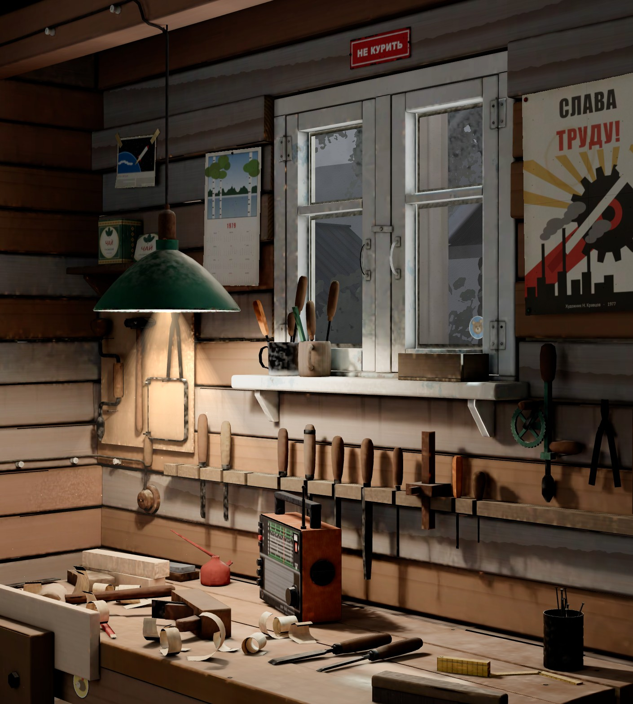
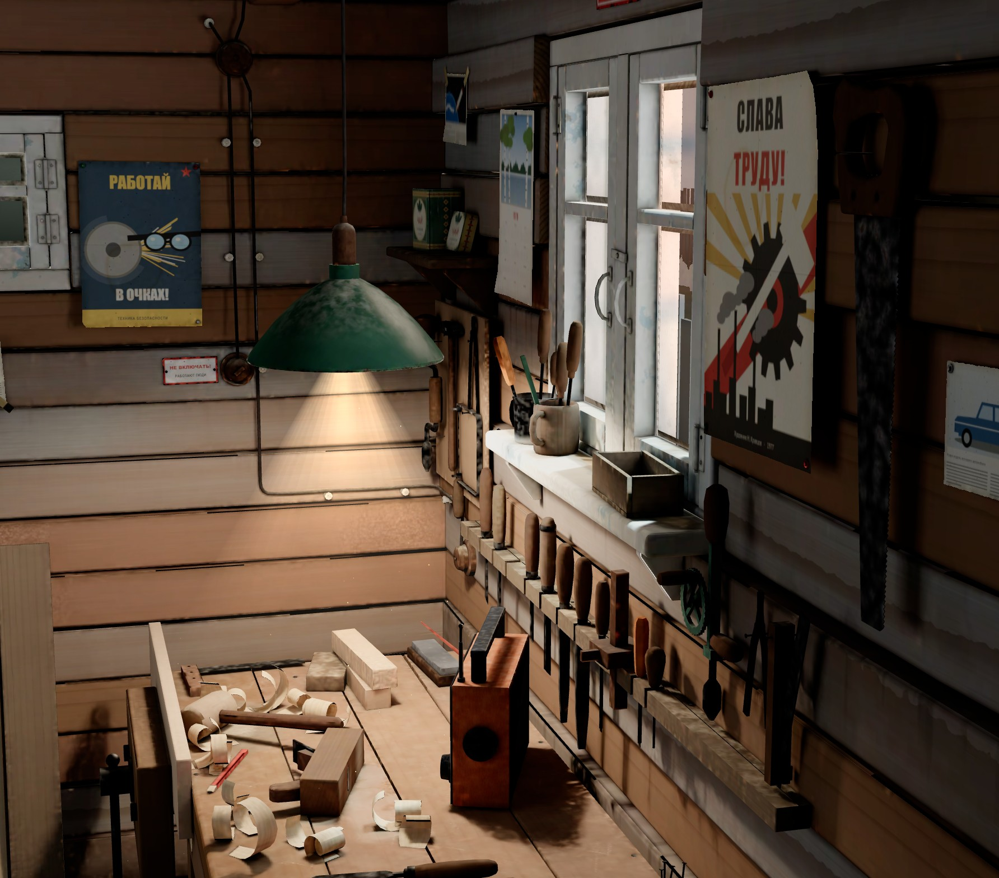
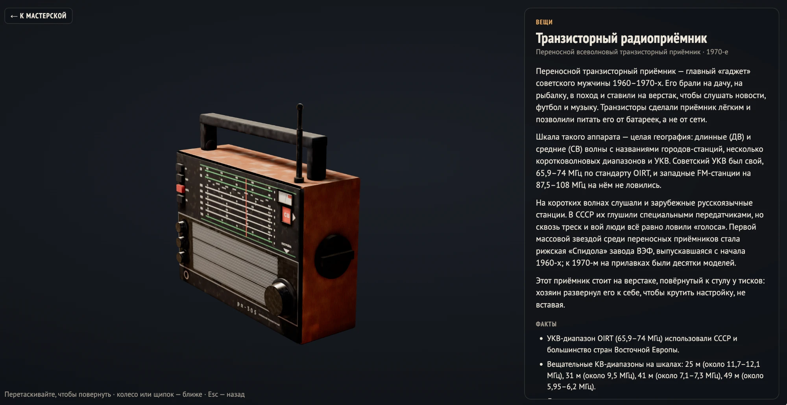
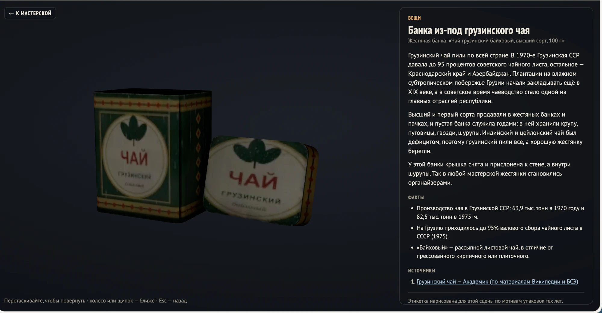
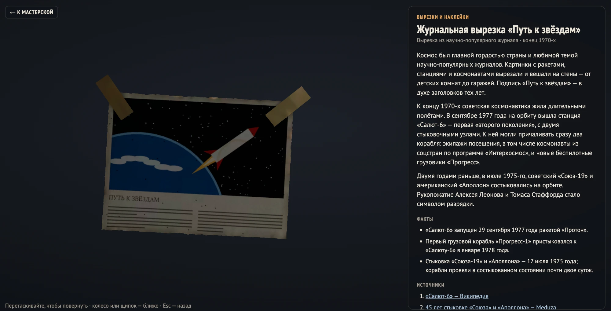

# Уголок мастерской

<p align="center">
  <a href="https://alexsumerr-lgtm.github.io/Russian-Vilage-Vibe/"></a>
</p>

<p align="center">
  <b><a href="https://alexsumerr-lgtm.github.io/Russian-Vilage-Vibe/">Открыть сцену в браузере →</a></b><br>
  На компьютере и на телефоне, ничего устанавливать не нужно
</p>

Интерактивная 3D-диорама: столярный уголок в старом дачном сарае, конец 1970-х, вечер после дождя. Сцену можно вращать и приближать, зажигать лампу, включать приёмник, а у каждой вещи есть карточка со своей историей.

## История

Сарай давно осел: венцы бруса разошлись и завалились, пропитка местами смылась, из щелей торчит пакля. Хозяин только что отошёл. В тисках осталась доска, рубанок лежит на боку на свежей стружке, стул отодвинут. Над верстаком горит лампа под зелёным эмалированным абажуром, углы тонут в полумраке, а в луче света плавает опилочная пыль.

На стенах всё, что копится в мастерской годами: плакаты «Слава труду!» и «Работай в очках!», табличка «Не курить», календарь на 1979 год, вырезка из журнала про космос, наклейки. На полке жестянка из-под грузинского чая, в ней шурупы. На верстаке транзисторный приёмник, развёрнутый к стулу, чтобы крутить настройку, не вставая.

За окном только что прошёл дождь. Грунтовая дорога в колеях и лужах, над ней стелется туман. Напротив изба с резными наличниками, за тюлем тёплый свет; берёзы, сирень, палисадник, деревянный столб с фонарём. Стрекочут сверчки, с крыши капает, где-то лают собаки, вдали гудит электричка. Иногда мимо окон проезжает красный мотоцикл с горящей фарой.

<p align="center">
  
  
</p>

## Что можно делать

- **Смотреть.** Вращать мышью или пальцем, приближать колесом или щипком.
- **Лампа.** Выключатель на стене гасит и зажигает её. Свет запечён в двух вариантах и меняется плавно; без лампы сарай освещают только сумерки из окон и уличный фонарь.
- **Приёмник.** Щелчок по нему включает шум эфира со свистом перестройки, кнопка ▶ — песни из папки [`radio`](radio/). У приёмника своя громкость, а свои песни можно добавить и с устройства, кнопкой «Песни…».
- **Звук.** Вечер вокруг сарая: каждый звук идёт со своего места и смещается, когда поворачиваешь сцену.
- **Осмотр.** Щелчок по любой вещи открывает её карточку: предмет крупно, его можно покрутить, рядом история, факты и источники.
- **Дымка и Блики.** Пыль в луче лампы и отражения на металле и стекле можно выключить.

<p align="center">
  
</p>

## 72 карточки

Рассмотреть можно всё: плакаты и таблички, вырезки и наклейки, инструмент (рубанок, стамески, коловорот, ручная дрель, рейсмус, малка, лобзик), мебель, электрику с открытой проводкой на роликах, вещи вроде маслёнки и оцинкованного ведра — и даже опилки со стружкой. В каждой карточке рассказ о вещи и её времени, факты с цифрами и ссылки на источники.

<p align="center">
  
  
  
</p>

Все надписи, плакаты и этикетки нарисованы для этой сцены по мотивам тех лет, настоящих логотипов и марок здесь нет.

## Звуки вечера

Сверчки, шелест листвы, капли с крыши, гудение уличного фонаря, разговоры у соседей, лай собак, скрип половиц, муха, калитка, далёкий гудок электрички и мотоцикл, который проезжает за окном ровно тогда, когда его слышно. Свист перестройки приёмника и гудение нити лампы синтезируются прямо в браузере.

## Песни для приёмника

Положите аудиофайлы в папку [`radio`](radio/): на GitHub это Add file → Upload files → Commit changes. Через одну-две минуты песни заиграют у всех: щёлкните по приёмнику, затем ▶. Подробности — в [radio/README.md](radio/README.md).

## Как сделано

- Модели, материалы и свет — Blender 5.2. Освещение запечено в Cycles в карты света, отдельно с лампой и без неё; блики дают PBR-материалы и проба окружения.
- Страница — three.js в одном файле `index.html`, без сборщиков; цвет, как в Blender, — AgX.
- Улицу за окном видно только сквозь стекло: её рисует отдельный проход по маске окна, а деревья и кусты — это карточки, отрендеренные с места окна.
- Около 117 тысяч треугольников, вся сцена весит 16 МБ.

## Как открыть у себя

Страницу нужно открывать через веб-сервер, а не двойным щелчком по файлу:

```bash
python3 -m http.server 8000 --bind 127.0.0.1
```

Потом откройте http://localhost:8000/ в браузере. `--bind 127.0.0.1` оставляет сервер доступным только с этого компьютера.
